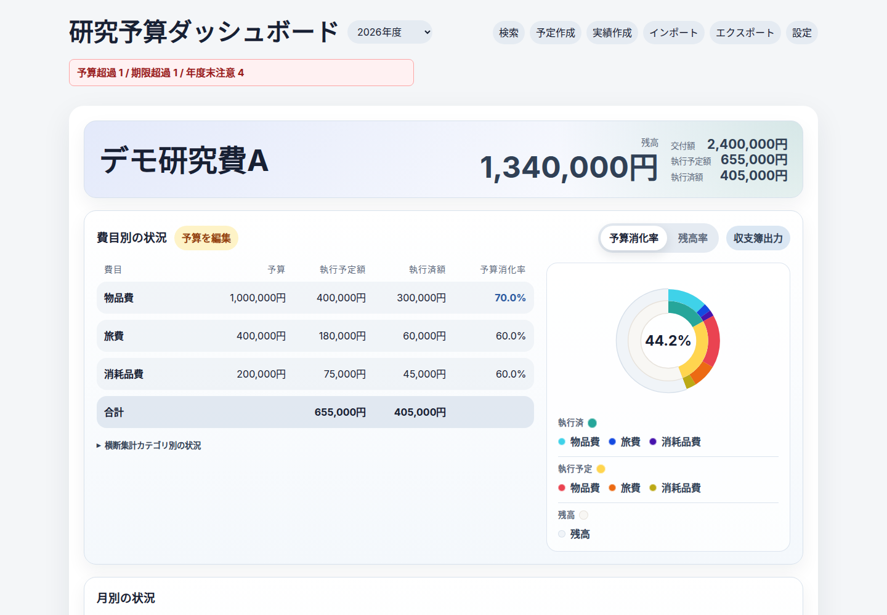
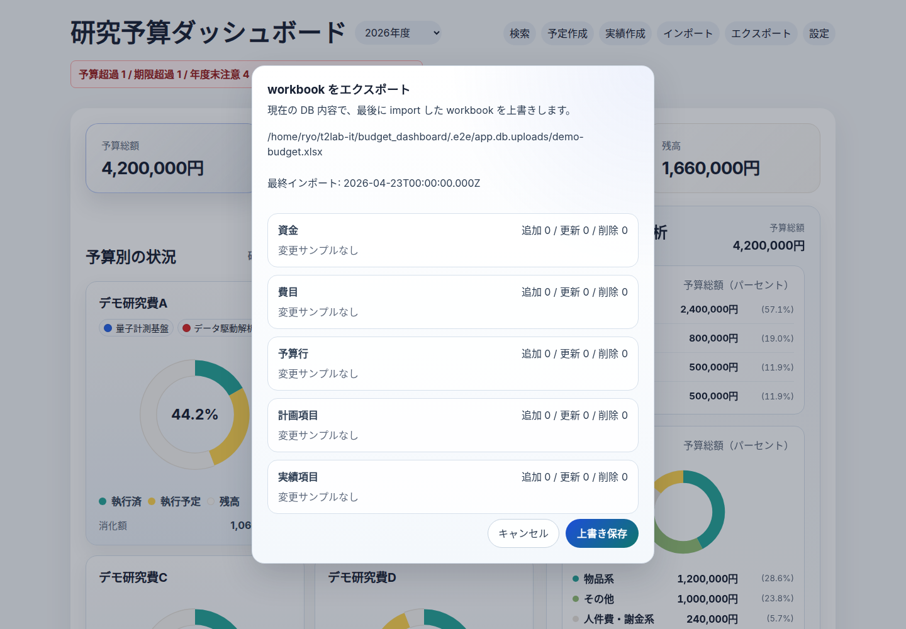

# 研究予算ダッシュボード

研究費予算の計画と実績を、`.xlsx` workbook を入口にして管理するローカル向けダッシュボードです。日常運用では workbook を編集し、その内容を SQLite に取り込んで、React 製 UI と Fastify API から確認します。

研究室、研究プロジェクト、個人研究費のように、年度内の予算枠、費目、執行予定、執行済みをまとめて見たい研究者向けです。狭義の grant だけでなく、共同研究費・学内研究費・委託費などの研究予算も対象にしています。会計システムそのものではなく、手元の workbook と DB を使って「計画と実績の見通し」を整理するための補助ツールです。

Repository / package name は `grant-dashboard` です。

## まず試す

- GitHub Pages デモ: <https://t2lab-it.github.io/grant-dashboard/>
- 最短ローカル起動: `npm install` → `npm run seed:demo` → `npm run dev`
- 自分の workbook で使う流れ:
  - template 作成: `npm run simple:template -- imports/budget2026.xlsx`
  - dry-run: `npm run simple:import:dry -- imports/budget2026.xlsx`
  - import: `npm run simple:import -- imports/budget2026.xlsx --replace`

静的デモはブラウザ内保存だけを使います。サーバー API / SQLite は使わず、実ファイルの workbook import/export も行いません。実データ運用はローカル起動後に行ってください。

ローカル起動後、空 DB または import 未実行状態の Overview には初回利用カードが表示されます。そこから blank template をブラウザでダウンロードし、ヘッダーの `インポート` で preview/import できます。CLI で同じ template を作る場合は `npm run simple:template -- <workbook-path>` を使います。

## 画面イメージ

以下の画像は `npm run seed:demo` で再現できる架空データから生成しています。公開用 fixture workbook は [`seeds/demo/demo-budget.xlsx`](seeds/demo/demo-budget.xlsx) です。


| Fund detail | Workbook export preview |
| --- | --- |
|  |  |

スクリーンショットは次で再生成できます。

```bash
npm run screenshots:demo
```

詳しい demo seed、静的デモの制限、画像再生成手順は [docs/demo.md](docs/demo.md) を確認してください。

## できること

- `.xlsx` workbook を dry-run して、取り込み前に件数と warning を確認する
- workbook を SQLite に import し、予算別・費目別・月別に計画と実績を確認する
- 予定項目と実績項目を UI から追加・更新する
- import 後の DB から JSON snapshot や確認用 Excel を export する
- 最後に import した workbook への round-trip export preview を確認する
- backup / restore で検証前後の DB を退避する

## できないこと / 制限

- 大学や研究機関の公式会計システムではありません
- 静的デモでは実ファイルの import/export、サーバー API、SQLite は使いません
- workbook は運用入力であり、runtime の source of truth は import 後の SQLite です
- `exports/current.json` はレビュー用の派生物であり、正本データではありません
- 実予算データ、個人情報、認証情報、未公開の脆弱性詳細を public issue / pull request / discussion に貼らないでください

## 詳細ドキュメント

- [Workbook 運用](docs/workbook.md)
  - workbook 形式
  - dry-run / import / replace
  - JSON export / 収支簿 Excel export / workbook round-trip export
  - backup / restore
- [公開デモとサンプルデータ](docs/demo.md)
  - GitHub Pages 静的デモ
  - demo seed と fixture workbook
  - スクリーンショット再生成
  - demo build 確認
- [開発者向けセットアップ](docs/development.md)
  - 開発起動
  - 主要画面と API
  - DB / migration
  - テストとビルド

## OSS と貢献

この repository は MIT License で公開しています。利用条件は [LICENSE](LICENSE) を確認してください。

Issue や pull request を作成する前に、[CONTRIBUTING.md](CONTRIBUTING.md) の開発手順とデータ安全性の注意を確認してください。データ安全性やセキュリティに関する相談は [SECURITY.md](SECURITY.md) を確認し、公開してよい範囲にサニタイズしてから issue template を使ってください。
